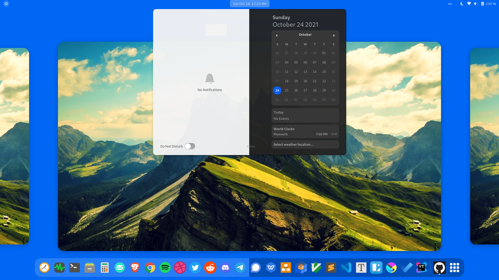
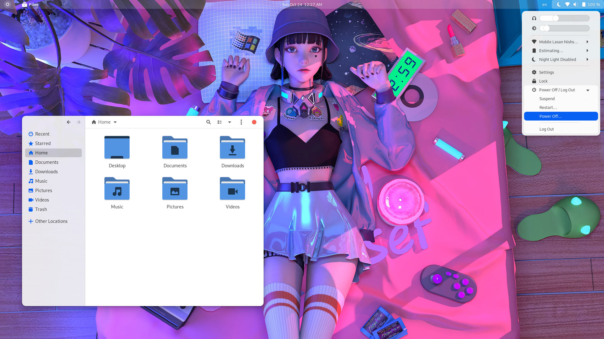
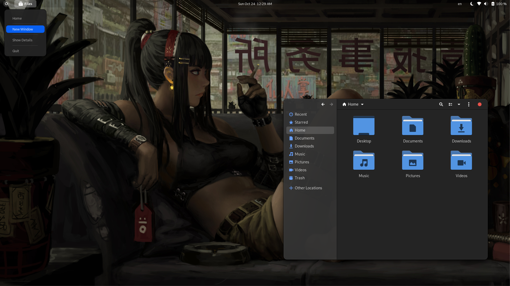

> GTK Theme for Gnome **40** / **41**

**Installation Steps**

- Download Theme Files
- Extract
- Paste it in `usr/share/themes/` directory
- Update themes using [Gnome Tewaks](https://itsfoss.com/gnome-tweak-tool/)

**More Screenshots**

> Follow me on Twitter [@las_nish](https://twitter.com/las_nish)
